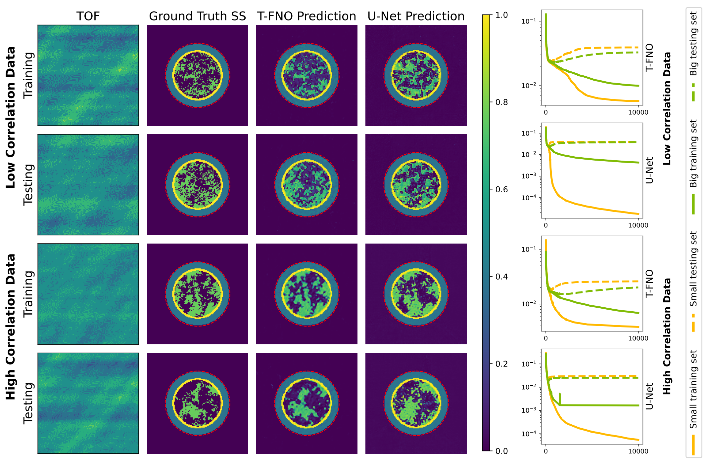

# Neural Operator Learning for Ultrasound Tomography Inversion
### [Paper](https://arxiv.org/pdf/2304.03297.pdf) | [Poster](https://users.cs.utah.edu/~haocheng/slides/midl2023.pdf)
[Haocheng Dai*](https://users.cs.utah.edu/~haocheng/),
[Michael Penwarden*](https://sites.google.com/view/michaelpenwarden),
[Mike Kirby](https://users.cs.utah.edu/~kirby/),
[Sarang Joshi](https://scholar.google.com/citations?user=GyqdQTEAAAAJ&hl=en) (\*equal contribution)<br>
Medical Imaging with Deep Learning (MIDL), 2023, Short Paper Track<br>


## What is a Ultrasound TFNO?

An ultrasound TFNO is a tensorized Fourier neural operator trained to estimating a speed of sound field that depict the acoustic preoperties of tissues. The network directly maps from the time-of-flight (TOF) data to a heterogeneous sound speed field, with a single forward pass through the model.This novel application of operator learning circumnavigates the need to solve the computationally intensive iterative inverse problem. It is the first time operator learning has been used for ultrasound tomography and is the first step in potential real-time predictions of soft tissue distribution for tumor identification in beast imaging.

## TL;DR quickstart

To setup a conda environment, begin the training process, and inference:
1. git clone this repo:
```
git clone https://github.com/aarentai/Ultrasound-Tfno-MIDL.git
```
2. Download dataset under the main directory:
```
cd Ultrasound-Tfno-MIDL/
git clone https://huggingface.co/datasets/aarentai/UltrasoundGRF
```
3. Create new environment:
```
conda env create -f environment.yml
conda activate ultra-tfno
```
4. Main scripts are under the `/Scripts` folder:
- `NoiseAdding.ipynb`: Adding noise to the time-of-flight data during the `xcorr` process. No need to run as the noised data is already provided.
- `SpeedOfSoundGeneration.ipynb`: Generating Gaussian random field as speed of sound data, before using k-wave simulation in matlab. No need to run as the data is already provided.
- `TofSsUnet.ipynb`: Training and inference from scratch using U-Net
- `TofSsTfno.ipynb`: Training and inference from scratch using T-FNO

## Dataset

You can download the [dataset](https://huggingface.co/datasets/aarentai/UltrasoundGRF) we used through
```
# Make sure you have git-lfs installed (https://git-lfs.com)
git lfs install
git clone https://huggingface.co/datasets/aarentai/UltrasoundGRF

# if you want to clone without large files – just their pointers
# prepend your git clone with the following env var:
GIT_LFS_SKIP_SMUDGE=1
```

In the dataset, the following subfolders contains:
- `tof_noise0`: time of flight data without any noise
- `tof_noise0.02`: time of flight data with 5% noise
- `tof_noise0.05`: time of flight data with 10% noise
- `sound_speed`: ground truth speed of sound data

Within the `tof_noise*` folder, you can interpret the file name `grf_high1_tof.mat` as `grf_{correlation_type}{id}_tof.mat`, namely time of flight data of a high correlation GRF field, the ID of which is 1. And this time of flight file corresponds to the `grf_high1_sound_speed.mat` in `speed_sound` folder.

Please refer to section `Data generation - Matlab k-wave simulation` for the details of how we generate the simulated data.

## Python Environment

Python 3.10 dependencies:
```
itk_core==5.3.0
itk_filtering==5.3.0
itk_meshtopolydata==0.10.0
itk_numerics==5.3.0
itkwidgets==0.32.6
lazy_import==0.2.2
matplotlib==3.7.1
numba==0.56.4
numpy==1.24.2
scipy==1.10.1
SimpleITK==2.2.1
tensorly==0.8.1
tensorly_torch==0.4.0
torch==1.13.1
torchvision==0.14.1
tqdm==4.65.0
wandb==0.13.11
```

We provide a conda environment setup file including all of the above dependencies. Create the conda environment `ultra-tfno` by running:
```
conda env create -f environment.yml
```
If errors raised during the installation, please refer to official instruction and install manually.

## Checkpoints

Under the `Checkpoints/` folder are all experiments we conducted for the paper
- `BigDataset/` Checkpoints trained with 200 low/high correlation GRF data:
    - `unet_{init_features}_grf{resolution}_{correlation}_{noise_configuration}/`: for example, `unet_32_grf128_low_noise0.05` is the experiment tested on U-Net with 32 initial features, with GRF data of resolution 128, low correlation, 5\% noise;
    - `tfno_modes{modes_num}_hc{hidden_channels}_pc{projection_channels}_grf{resolution}_{correlation}_{noise_configuration}/`: for example, `tfno_mode64_hc32_pc32_grf128_low_noise0.05` is the experiment tested on T-FNO with 64 modes, 32 hidden channels, 32 projection channels, with GRF data of resolution 128, low correlation, 5\% noise.
- `SmallDataset/` Checkpoints trained with 100 low/high correlation GRF data

## Data generation - Matlab k-wave simulation

For those who want to generate data by themselves, we also provide the matlab simulation scripts for your convenience.
1. Install Matlab linux
    - Download [Matlab linux](https://www.mathworks.com/downloads/)
    - Run following command
    ```
    unzip PATH_TO_ZIP_FILE -d PATH_TO_TARGET_DIRECTORY
    sudo mkdir /usr/local/MATLAB
    sudo mkdir /usr/local/MATLAB/YOUR_MATLAB_VERSION
    sudo chown YOUR_USER_NAME /usr/local/MATLAB
    sudo chown YOUR_USER_NAME /usr/local/MATLAB/YOUR_MATLAB_VERSION
    cd PATH_TO_TARGET_DIRECTORY
    ./install
    ```
2. Install [k-wave toolbox](http://www.k-wave.org/installation.php);
3. Install [Communications Toolbox](https://www.mathworks.com/products/communications.html?s_tid=srchtitle_site_search_3_Communications), [DSP System Toolbox](https://www.mathworks.com/products/dsp-system.html?s_tid=srchtitle_site_search_2_dsp%2520system), [Image Processing Toolbox](https://www.mathworks.com/products/image.html?s_tid=srchtitle_site_search_1_image%2520processing), [Parallel Computing Toolbox](https://www.mathworks.com/products/parallel-computing.html) [Signal Processing Toolbox](https://www.mathworks.com/products/signal.html), [Wavelet Toolbox](https://www.mathworks.com/products/wavelet.html);
4. Run `Scripts/simulation_water.m` in matlab by modifying the I/O path and parameter configuration accordingly;
5. Run `Scripts/simulation_grf.m` by modifying the I/O path and parameter configuration accordingly, which will subtract the time of flight of the homogenous water field from the one of the GRFs.

## Citation

```
@misc{dai2023neural,
      title={Neural Operator Learning for Ultrasound Tomography Inversion}, 
      author={Haocheng Dai and Michael Penwarden and Robert M. Kirby and Sarang Joshi},
      year={2023},
      eprint={2304.03297},
      archivePrefix={arXiv},
      primaryClass={eess.IV}
}
```